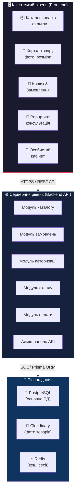
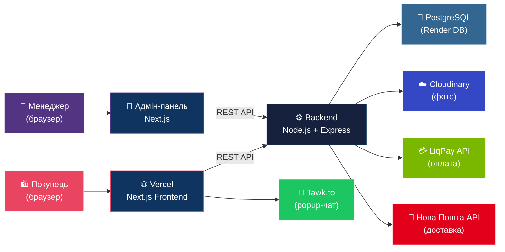
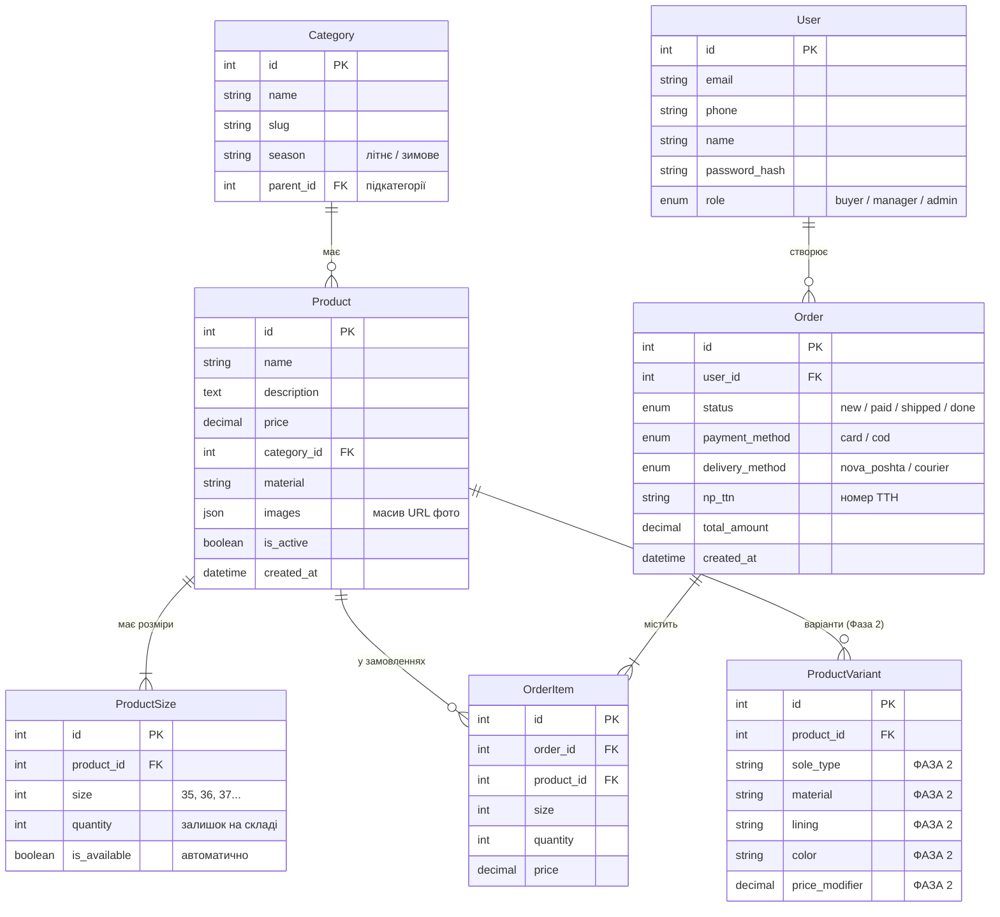
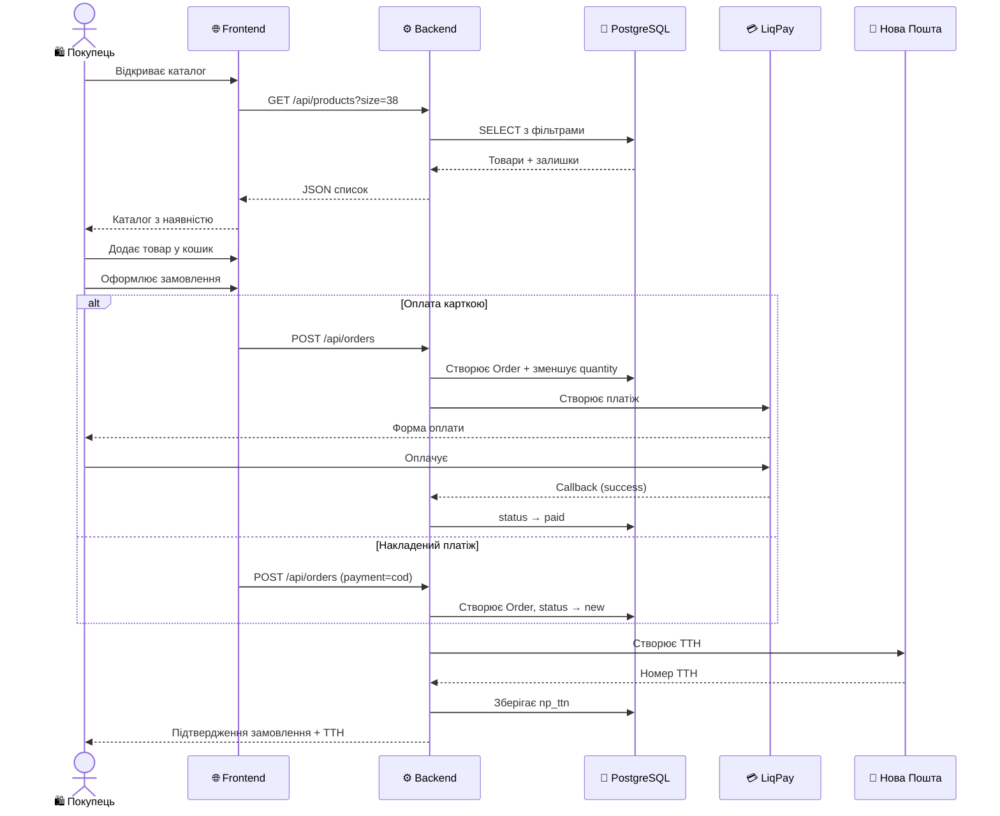

# Архітектурна схема системи — LiLu E-Commerce MVP

**Автор:** Мульков Максим (Dev/QA, частково SA)
**Дата:** 06.04.2026
**Версія:** 2.0

---

## 1. Загальна архітектура системи (Three-Tier)

---

## 2. Діаграма взаємодії компонентів

---

## 3. ER-діаграма бази даних

> ⚠️ `ProductVariant` — НЕ реалізується в MVP. Закладена в схему для Фази 2 (конструктор).

---

## 4. Обраний технологічний стек

| Компонент | Технологія | Обґрунтування |
|---|---|---|
| **Frontend** | Next.js (React) | SSR для SEO каталогу, швидкий рендеринг |
| **CSS** | Tailwind CSS | Швидка розробка адаптивного UI |
| **Backend** | Node.js + Express | Єдина мова JS/TS, швидкість розробки |
| **ORM** | Prisma | Типізація, міграції, зручна робота з PostgreSQL |
| **База даних** | PostgreSQL | Надійна, безкоштовна, JSON для варіацій |
| **Кешування** | Redis (Upstash) | Швидкий доступ до залишків, сесії |
| **Фото** | Cloudinary | Зберігання та автооптимізація зображень |
| **Оплата** | LiqPay (ПриватБанк) | Найпоширеніший шлюз в Україні |
| **Доставка** | Нова Пошта API | Офіційний API, розрахунок вартості + ТТН |
| **Popup-чат** | Tawk.to | Безкоштовний, вимога клієнта |
| **Хостинг** | Vercel + Railway/Render | Free tiers для MVP |
| **Домен** | .ua (Hostiq) | Географічна прив'язка |

---

## 5. Потік замовлення (User Journey)

---

## 6. Ключові архітектурні рішення

### 6.1. Облік складу в реальному часі
- Наявність у таблиці `ProductSize` (запис для кожного розміру).
- При замовленні `quantity` зменшується автоматично.
- `quantity = 0` → розмір «Немає в наявності» на сайті і в адмін-панелі.

### 6.2. Підготовка до конструктора (Фаза 2)
- Таблиця `ProductVariant` закладена в ER-схему.
- Комбінації: підошва × матеріал × підклад × колір.

### 6.3. Безпека
- bcrypt для паролів, JWT для авторизації.
- HTTPS (SSL від Vercel / Let's Encrypt).
- Валідація через Prisma ORM (захист від SQL-ін'єкцій).

### 6.4. Mobile-first
- Більшість покупців Наталії приходять з Instagram → з телефону.
- Адаптивний дизайн: мобільний → планшет → десктоп.

---

## 7. Зовнішні інтеграції

| Інтеграція | Провайдер | Що робить | Sprint |
|---|---|---|:---:|
| Оплата карткою | LiqPay | Прийом онлайн-платежів | 2 |
| Накладений платіж | Власна логіка | Позначка "оплата при отриманні" | 2 |
| Доставка НП | Нова Пошта API | Вибір відділення, ТТН | 2 |
| Кур'єр | Власна логіка | Фіксована ціна по місту | 2 |
| Popup-чат | Tawk.to | Зв'язок з менеджером | 2 |
| Фото товарів | Cloudinary | Завантаження, оптимізація | 1 |
