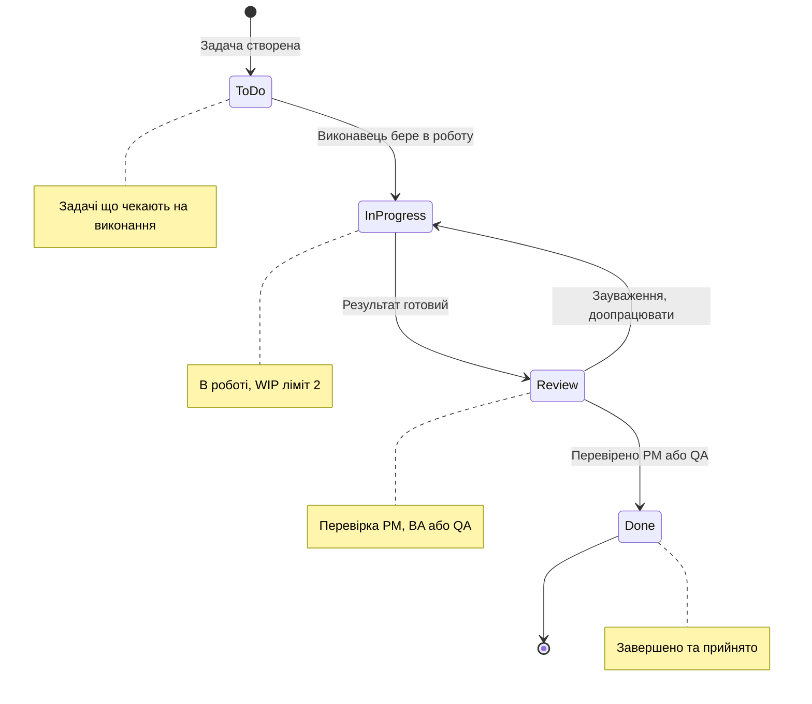
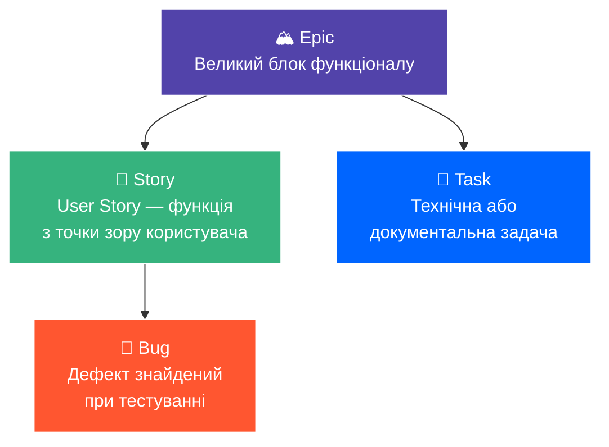
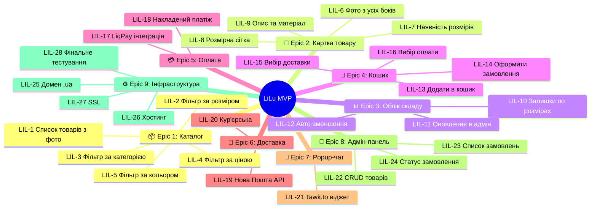
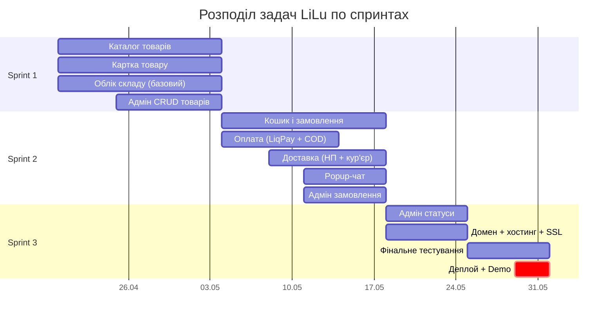

# Jira Workflow — LiLu E-Commerce

**Автор:** Мульков Максим (Dev/QA)
**Дата:** 06.04.2026
**Версія:** 2.0

---

## 1. Workflow (потік статусів задач)

---

## 2. Тип дошки та колонки

**Scrum Board** — відповідає Adaptive/Scrum методології.

### Правила переходу:
| З → До | Хто переводить | Умова |
|---|---|---|
| To Do → In Progress | Виконавець | Взяв задачу в роботу |
| In Progress → Review | Виконавець | Артефакт готовий для перевірки |
| Review → Done | PM або QA | Перевірено, прийнято |
| Review → In Progress | PM або QA | Повернення на доопрацювання |

---

## 3. Типи тікетів

---

## 4. Карта Epics та Stories для MVP

---

## 5. Повна таблиця Backlog

### Sprint 1 (Тижні 3–4): Каталог + Облік складу

| ID | Story / Task | Пріоритет | Epic |
|---|---|:---:|---|
| LIL-1 | Як покупець, я хочу бачити список товарів з фото | 🔴 Must | Каталог |
| LIL-2 | Як покупець, я хочу фільтрувати за розміром | 🔴 Must | Каталог |
| LIL-3 | Як покупець, я хочу фільтрувати за категорією | 🔴 Must | Каталог |
| LIL-4 | Як покупець, я хочу фільтрувати за ціною | 🟡 Should | Каталог |
| LIL-5 | Як покупець, я хочу фільтрувати за кольором | 🟡 Should | Каталог |
| LIL-6 | Як покупець, я хочу бачити фото з усіх боків | 🔴 Must | Картка |
| LIL-7 | Як покупець, я хочу бачити наявність кожного розміру | 🔴 Must | Картка |
| LIL-8 | Як покупець, я хочу бачити розмірну сітку | 🔴 Must | Картка |
| LIL-9 | Як покупець, я хочу бачити опис та матеріал | 🟡 Should | Картка |
| LIL-10 | Як менеджер, я хочу бачити залишки по розмірах | 🔴 Must | Склад |
| LIL-11 | Як менеджер, я хочу оновлювати залишки в адмін-панелі | 🔴 Must | Склад |
| LIL-22 | Як менеджер, я хочу додавати/редагувати товари | 🔴 Must | Адмін |

### Sprint 2 (Тижні 5–6): Кошик + Оплата + Доставка

| ID | Story / Task | Пріоритет | Epic |
|---|---|:---:|---|
| LIL-12 | Автоматичне зменшення залишку при замовленні | 🔴 Must | Склад |
| LIL-13 | Як покупець, я хочу додати товар у кошик | 🔴 Must | Кошик |
| LIL-14 | Як покупець, я хочу оформити замовлення | 🔴 Must | Кошик |
| LIL-15 | Як покупець, я хочу обрати спосіб доставки | 🔴 Must | Кошик |
| LIL-16 | Як покупець, я хочу обрати спосіб оплати | 🔴 Must | Кошик |
| LIL-17 | Інтеграція LiqPay (оплата карткою) | 🔴 Must | Оплата |
| LIL-18 | Опція «накладений платіж» | 🔴 Must | Оплата |
| LIL-19 | Інтеграція Нова Пошта API | 🔴 Must | Доставка |
| LIL-20 | Опція «кур'єрська доставка» | 🟡 Should | Доставка |
| LIL-21 | Інтеграція Tawk.to (popup-чат) | 🔴 Must | Popup |
| LIL-23 | Як менеджер, я хочу бачити список замовлень | 🔴 Must | Адмін |

### Sprint 3 (Тижні 7–8): Інтеграції + Тестування + Деплой

| ID | Story / Task | Пріоритет | Epic |
|---|---|:---:|---|
| LIL-24 | Як менеджер, я хочу змінювати статус замовлення | 🟡 Should | Адмін |
| LIL-25 | Реєстрація домену .ua | 🔴 Must | Інфра |
| LIL-26 | Налаштування хостингу (Vercel + Render) | 🔴 Must | Інфра |
| LIL-27 | Налаштування SSL (HTTPS) | 🔴 Must | Інфра |
| LIL-28 | Фінальне тестування перед запуском | 🔴 Must | Інфра |

---

## 6. Розподіл по спринтах (візуалізація)

---

## 7. Мітки (Labels)

| Label | Колір | Використання |
|---|---|---|
| `must-have` | 🔴 Червоний | Критичний функціонал MVP |
| `should-have` | 🟡 Жовтий | Важливо, але можна відкласти |
| `could-have` | 🟢 Зелений | Бонусний функціонал |
| `phase-2` | 🔵 Синій | Фаза 2 (конструктор) |
| `bug` | ⚫ Чорний | Дефекти |

---

## 8. Правила роботи з дошкою

1. **Кожна Story має Acceptance Criteria** — без них задача не переходить в "Done".
2. **WIP ліміт:** макс. 2 задачі в "In Progress" на одного учасника.
3. **Daily Update:** кожен оновлює статус тікетів щодня.
4. **Баги пріоритетніші** за нові Story.
5. **Sprint Retrospective:** наприкінці кожного спринту обговорення що покращити.
